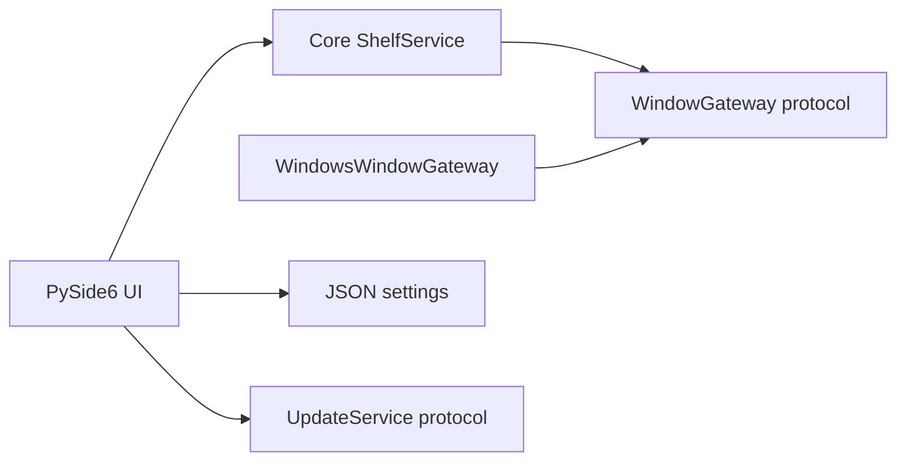

# Architecture

ShelfyGAI uses a small layered architecture so the Windows-specific behavior is easy to inspect and test.

## Layers

- `core`: domain models, protocols, errors, and window-management use cases.
- `platform/windows`: pywin32 and ctypes adapter for the Windows desktop APIs.
- `settings`: local JSON settings persistence.
- `crash`: global crash handling, diagnostic reports, and emergency recovery state.
- `logging_config`: rotating local application logs with startup, shutdown, exception, settings, and window-operation events.
- `ui`: PySide6 onboarding, application window, theme, and user interactions.
- `updates`: offline-safe update-checking abstraction reserved for future GitHub Releases integration.
- `resources`: bundled visual assets such as the app icon.

## Dependency Direction

The UI depends on core use cases. The core depends only on protocols. Platform adapters implement those protocols. This keeps the hidden-window rules testable without requiring a live Windows desktop.

## First Launch

`main.run` loads settings before creating the main window. If onboarding has not been completed, it shows the reusable onboarding/settings dialog first. Saving the dialog persists settings to `%APPDATA%\ShelfyGAI\settings.json`; closing it during first launch exits without opening the main window.

## Window Lifecycle

1. The UI asks `ShelfService` for available windows.
2. `WindowsWindowGateway` enumerates top-level visible user windows and filters shell or internal windows.
3. The user hides selected handles.
4. `ShelfService` records the window metadata and asks the gateway to manage the handle.
5. `WindowsWindowGateway` preserves the original extended style, applies the selected hide options with `SetWindowLong`, and refreshes the frame with `SetWindowPos`.
6. Restoring writes the original extended style back, refreshes the frame, and removes the window from the hidden-window registry.

By default, `MainWindow.closeEvent` restores all hidden windows before closing the app. While windows are hidden, ShelfyGAI also writes `%APPDATA%\ShelfyGAI\recovery.json` with the original extended styles. Fatal exception handling and the next launch both use that emergency state to restore still-live windows when possible.

## Groups

`ShelfService` owns group metadata and hidden-window group assignment. The UI persists groups, the selected group, and last-known hidden-window metadata through `SettingsManager`. Saved HWND metadata includes a boot identifier, and settings normalization drops records from earlier boots so stale handles are never restored after a restart.

## System Tray And Hotkeys

The main window owns tray lifecycle, close-to-tray behavior, and global hotkey registration. Global hotkeys use the Windows `RegisterHotKey` API through `platform/windows/hotkeys.py`; ShelfyGAI does not install low-level keyboard hooks. Hotkeys are unregistered during application shutdown.

## Startup

Windows startup integration is current-user only. The startup helper reads and writes `HKCU\Software\Microsoft\Windows\CurrentVersion\Run`, validates the executable path before writing, and reports whether an existing startup entry is missing, invalid, or healthy. No administrator rights are required.

## Updates

The update layer is intentionally a placeholder. `UpdateService` defines the app-facing boundary, and `GitHubReleasesUpdateService` prepares the future GitHub Releases endpoint while returning an offline local result. It does not perform network requests, download installers, or apply updates.

## Privacy Boundary

Window titles, executable paths, process names, settings, and logs remain local. The architecture does not include telemetry, analytics, cloud sync, or a network listener.
